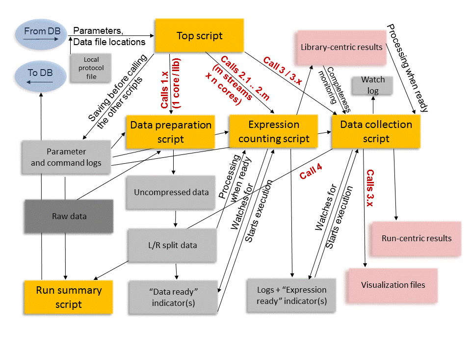

# GLSeq: Pipeline for low-level RNA-Seq data processing 



**The overview of GLSeq**. _Supplementary figure, Moskvin et. al. (2015) [Article Online](http://www.tandfonline.com/doi/full/10.1080/21628130.2015.1010923) 


----
## Introduction

**GLSeq** ("GL" stands for "Great Lakes") is a pipeline facilitating low-level processing of the RNA-Seq data. This includes (optional) trimming of the sequencing reads, genome (or transcriptome) alignment and feature coverage counting, using either hard-threshold or probabilistic approaches.  

The pipeline was used to compare low-level data processing options in our recent study (see the reference below). At the moment, it is focused on providing gene-level information (except for annotation-agnostic read coverage visualizations when genome alignemnt option is chodsen). Soon, it will be extended to generate experiment-wide summaries of transcript-level results useful for alternative splicing studies. 

The pipeline is written by biologist for biologists, using R language. Unlike usual R scripts, the GLSeq scripts are not intended to be loaded into an R session; they must be used as command-line scripts with options, on top of "Rscript" command (see operation manual). 

## Features
- support for single- or paired-end libraries
- support for strand-specific libraries 
- easy setup of multithreading by the end-user via providing the number of computation streams and CPUs per stream in the run-specific attributes file
- unattended processing of large sets of libraires regardless of the available computational resources
- option to run splitting by strand coverage when using concatenated FASTQ files for paired-end libraires (at the "data preparation" step)
- generating both library-specific count files and experiment-centric tables of counts, FPKM etc. 
- providing 3 types of visualization files (bam, WIG, BigWIG), with strand-specific versions, where applicable

## Prerequisites

- Linux workstation 
- R [R-Project](http://r-project.org)
- Ruby [Ruby Language](https://www.ruby-lang.org/en/)
- Perl [Perl Language](https://www.perl.org/)
- Java [Oracle Java](https://www.oracle.com/java/index.html)
- Python [Python Language](https://www.python.org/)

## Citing GLSeq
If you use the GLSeq package, please cite:

- Moskvin O.V., McIlwain S., Ong I.M. (2015) Making sense of RNA-Seq data: from low-level processing to functional analysis. *Systems Biomedicine (Special CAMDA-2014 Issue)* [Online version is here](http://www.tandfonline.com/doi/full/10.1080/21628130.2015.1010923). Preprint (October 17, 2014) doi: [10.1101/010488](http://dx.doi.org/10.1101/010488)

If you use Bowtie-RSEM as part of your customized pipeline, please also cite:

- Langmead B, Trapnell C, Pop M, Salzberg SL. (2009) Ultrafast and memory-efficient alignment of short DNA sequences to the human genome. *Genome biology* 10:R25
- Li B, Dewey CN. (2011) RSEM: accurate transcript quantification from RNA-Seq data with or without a reference genome. *BMC bioinformatics* 12:323

If you use BWA-HTSeq as part of the pipeline, please also cite:

- Li H, Durbin R. (2009) Fast and accurate short read alignment with Burrows-Wheeler transform. Bioinformatics 25:1754-1760
- Anders SP, P.T.; Huber, W. HTSeq - A Python framework to work with high-throughput sequencing data. doi: [10.1101/002824](http://dx.doi.org/10.1101/002824)
- Picard project [Picard Tools](http://broadinstitute.github.io/picard/)

If you use FeatureCounts option (coming soon), please also cite:

- Liao Y., Smyth G.K., Shi W. (2014) featureCounts: an efficient general purpose program for assigning sequence reads to genomic features. *Bioinformatics* 30(7): 923-930

If you use CUSHAW with optional GPU acceleration as aligner (coming soon), please also cite: 

- Liu Y., Schmidt B., and Maskell D.L. (2012) CUSHAW: a CUDA compatible short read aligner to large genomes based on the Burrows-Wheeler transform. *Bioinformatics* 28(14): 1830-1837

If you use Trimmomatic, please cite: 

- Bolger AM, Lohse M, Usadel B. (2014) Trimmomatic: a flexible trimmer for Illumina sequence data. *Bioinformatics* 30:2114-2120


## Usage 

### Preparing Genome Reference    

The genome reference (pre-built for use with a particular aligner - see below) should be located in a subfolder under the folder that contains GLSeq scripts. The name of the subfolder is the name of your reference (i.e. the same name which you used to prepare the reference).   

Example: ``` /path-to-GLSeq/hg19.RSEM ```


#### Setting up the reference for RSEM   

Reference for RSEM should be preapred according to the instuctions given on [RSEM website](http://deweylab.biostat.wisc.edu/rsem/rsem-prepare-reference.html). 

#### Setting up the reference for BWA    

See [BWA Reference page](http://bio-bwa.sourceforge.net/bwa.shtml)    

Briefly, run ``` bwa index yourgenomesequence.fasta ```    
On top of that, run  ``` samtools faidx yourgenomesequence.fasta  ```  

#### Setting up the reference for CUSHAW    

See [CUSHAW Reference page](http://cushaw2.sourceforge.net/homepage.htm#latest)   

_the CUSHAW pipeline is under development at the moment_

#### Optional: generate a "dual-feature" gtf file    
If you have a strand-specific library and need to have an idea about the fidelity of your strand-specific protocol and detect a few cases of strong antisense transcriptional activity (we don't promise the applicabilty of theis trick to detailed studies of the antisense transcription, though), you may generate a "dual-feature" annotation gtf file from your available gtf file using this command:    

```  Rscript GLSeq.dualReference.R yourfile.gtf yourfile_dual.gtf  ```   


So, for every record in your original gtf file that looks like this - 

``` 
NC_XXXXX  RefSeq  exon	679	2097	.	+	.	gene_id "gene0";transcript_id "gene0"      

```

you will have this stack of records in the "dual-feature" gtf file:   


``` 
NC_XXXXX  RefSeq	exon	679	2097	.	+	.	gene_id "gene0";transcript_id "gene0"      

NC_XXXXX	RefSeq	exon	679	2097	.	-	.	gene_id "gene0.ANTISENSE";transcript_id "gene0.ANTISENSE"    

NC_XXXXX	RefSeq	ncRNA	679	2097	.	-	.	gene_id "gene0.ANTISENSE";transcript_id "gene0.ANTISENSE"  

``` 

If you have more identifiers in the 9-th column of the gtf file beyond the minimal set of ```gene_id``` and ```transcript_id``` (gene names etc.), the ".ANTISENSE" will be appended to all of them in the antisense records. 

The resulting file will be useful to check which sense-to-antisense ratio you actually have in your strand-specific library (in an ideal case, it should approach infinity - capped by the magnitude of biologically relevant antisense transcriptional activity, and it will be 1 in the case of non-strand-specific libraries).   


### Running the Pipeline  

To run the pipeline, you need to;   

1. Have the software listed in the "Prerequisites" installed;   
2. Have your FASTQ files in either compressed / unprocessed or pre-processed form;   
3. Have created the base directory for the run (on a fast drive, preferrably); 
4. Create the run attribute file on the basis of GLSeq.attr.R 

#### Data and envoronment 

GLSeq needs the directory with either raw/compressed FASTQ files (if "dataprep" option - see below) is chosen or pre-processed ready-to-go files (if "nodataprep" is chosen). Those are referred to in the attribute file as ```raw.dir``` and ```readyData.dir```, respectively.    

The base directory of the results (a particular run will create its own subfolder under that) should be recorded in the attribute file as a value of ```dest.dir.base``` 

Please add the full paths to all the utilities listed in the "Environment" section of the ```GLSeq.attr.R``` into your custom attribute file (below).  

Names of the input FASTQ files need to have the same length. If this is not the case, please rename the files to satisfy this requirement using ```GLSeq.rename.fastq.files.R``` script by [ybukhman](https://github.com/ybukhman)

#### Preparing the attribute file   

You will need to change the values in the ```GLSeq.attr.R``` file before the run. Locations of all the relevant directories, processing methods and their parameters are located there. The file is extensively commented and self-descriptive. 

#### Quick start: "1 click mode" of pipeline execution 

GLSeq consists of several scripts that are responsible for different stages of the data processing and depending on the chosen variation of a pipilene, the scripts call each other, wait for the complete results of the execution of an upstream script etc. (Fig. 1). For extra flexibility, GLSeq uses two sets of options - a long list that is recorded in GLSeq.XXX.attr.R file (above) and a short list that is supplied directly as command-line options to the top script (listed in detail below).

Briefly, a user needs to: 

1. Edit GLSeq.attr.R file (or rather create a custom copy of it, for the record) for every run, to include parameters of the library, location of raw and (if any) pre-processed FASTQ files;
2. Execute as a command-line script with relevant command-line parameters:

```
Rscript GLSeq.top.R [pre-defined sequence of parameters] 
```
**Sequence and meaning of the parameters**: 

1. Update the attributes from a database?   
values: _update_, _noupdate_   
In a normal case, _noupdate_ should be used. The script has a capability to override the attribute values in the attribute file with values retrieved from a database, if you have a large volume of data to process and prefer to keep all the run information in a database and load them into the database before the run. This route requires substantial developments by the user, depends on your particular database schema and is not supported. An example implementation is of such communication between GLSeq and a database (which is tested to be functional in our particular setting) is given in the code of _GLSeq.top.R_. If you choose to implement this route, you must already know what you are doing. 

2. Pre-process the data?   
values: _dataprep_, _nodataprep_   
In the case of _nodataprep_, the ready-to-go FASTQ files (with .fq extensions for single-end libraries and .1.fq / .2.fq extentions for the paired-end libraries) are expected to be located in the _readyData.dir_ folder (as indicated in the _GLSeq.attr.R_ file).   
With _dataprep_, the particular behavior will depend on parameter setting under "PRE-PROCESSING OPTIONS" in the attribute file.   

3. Caclulte the gene expression?   
values: _exprcalc_ (normal), _noexprcalc_ (the case of using the pipeline to run either data pre-processing only or results collection only - see "Separate run of the pipeline modules" below). 

4. Collect the results?   
values: _collect_ (normal), _nocollect_ (for either pure data pre-processing or expression computation or combination of the two - see "Separate run of the pipeline modules" below). 

5. Run ID   
value: a text string (no spaces) that is short and meaningful to you. Good idea is to include an abbreviation of the main factors that you are changing in several pipeline runs, for fast visual identification of the relevant pipeline runs. It will be incorporated into the subfolder and file names of the output. If you choose to use database communication option, this ID will also be used to retrieve atributes from the database for processing and write back the run status.  

6. Protocol ID   
value: unique protocol ID used as a key to retrieve atributes from the "protocol" table of the database (if you are not using a database, keep this value to 0 (zero)). 

7. Path to the attribute file   
value: absolute path to the attribute file on your system ( /home/john/myGLSeqTestRun/GLSeq.attr.SuperTest.R)  
it is convenient to keep it under ```dest.dir.base``` however it may be located anywhere you choose. 

8. Ampersand   
value: &   
Sends the pipeline to background. In a few minutes, you may notice the system message that the job (which is supposed to be run for hours / days / weeks, depending on your dataset) is done. Please don't worry: it is related to the mission of the top script itself; the processes it started will work by themselves. 


#### Separate run of the pipeline modules

Sometimes you may want to sacrifice the convenience of the one-click running mode and run just a subset of pipeline blocks (defined by the command line parameters). Examples are:   

1. You want to pre-process your data for use in several pipelines (i.e. with alignment / counting via different methods). If you use read trimming, especially with a moderate-to-large size of the file containing artificial sequences to be removed from your data, saving the result for future pipeline runs may be essential to save time (use dataprep + noexprcalc + nocollect);    
2. You want to re-run a different alignment / counting method with your pre-processed data (use nodataprep + exprcalc + collect);    
3. You want to explicitly collect the results after expression calculation stage when a one-click run is crashed for some unforeseen reason (use nodataprep + noexprcalc + collect).    

#### Structure of the results 

Depending on the processing route chosen, the contents of the following directories may differ by file naming patterns and content but the files they contain will always be (generally) of the same type.   

**RUN_ID.counts subfolder**  

Contains summarized (run-wide, for all libraries side-by-side) count values, including separate csv files for unnormalized and normalized (FPKM, TPM) counts.

**RUN_ID.viz subfolder**    

Visualization files, including bam (with their indices), wiggle and BigWig files. Wherever appropriate (strandExtract == TRUE in the attribute file), starnd-specific .bam, .wig and .bw files will be also saved there (splitting the files by strand is done to reflect the strand coverage of the original mRNA in the sample rather than in a naive way by keeping reads mapped to that particular strand). 

**RUN_ID.stat subfolder**   

This folder contain run log files and other info you would normally not look at, plus library-specific count files generated before the collection step. 

### Getting help
Please subscribe to our [low-volume mailing list managed by Google groups](https://groups.google.com/forum/?hl=en#!forum/glseq-users)
